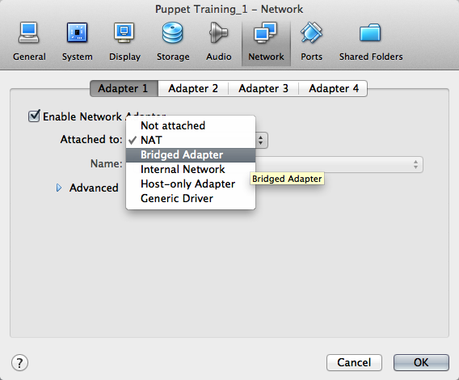

Learning Puppet
=====================================

### Welcome

This is Learning Puppet, a series of lessons about managing system configuration with Puppet Enterprise. [Installation instructions](https://docs.puppetlabs.com/pe/latest/install_basic.html) and [a complete reference to the Puppet language](https://docs.puppetlabs.com/puppet/latest/reference/lang_summary.html) are available elsewhere on the site; this series is meant to be a guided tour to building things with Puppet.

If you've heard good things about Puppet but don't know where to start, this is the best place to begin.

### Get the Free VM

Puppet can configure or misconfigure nearly any aspect of a system, so when learning how to use it, it's best to have some test systems around.

To help with this, we provide a free virtual machine with Puppet already installed. Experiment fearlessly!

[Get the Learning Puppet VM](http://info.puppetlabs.com/download-learning-puppet-VM.html)

While it downloads, move on to [the first chapter of Learning Puppet](./ral.md). 

The Learning Puppet VM is available in VMWare .vmx format and the cross-platform OVF format, and has been tested with VMWare Fusion and VirtualBox.

### Login Info

    - Log in as `root`, with the password `puppet`.
    - The VM is configured to write its current IP address to the login screen about ten seconds after it boots. If you prefer to use SSH, wait for the IP address to print and ssh to `root@<ip address>`.
    - To view the Puppet Enterprise web console, navigate to **https://(your VM's IP address)** in your web browser. Log in as `puppet@example.com`, with the password `learningpuppet`.
    - **Note:** If you want to create new user accounts in the console, the confirmation emails will contain incorrect links. You can work around this by copy-pasting the links into a web browser and fixing the hostname before hitting enter, or you can make sure the console is available at a reliable hostname and [follow the instructions for changing the authentication hostname](/pe/latest/trouble_console-db.html#console-account-confirmation-emails-have-incorrect-links).

If you'd rather cook up your own VM than download one from the web, you can imitate it fairly easily: this is a stripped-down CentOS system with a hostname of "learn.localdomain," [Puppet Enterprise](http://puppetlabs.com/puppet/puppet-enterprise/) installed, and `iptables` disabled. (It also has Puppet language modes installed for Vim and Emacs, but that's not strictly necessary.)

To begin with, you won't need separate agent and master VMs; this VM can act in both roles. When you reach the agent/master exercises, we'll walk through duplicating the system into a new agent node.

[Learning Puppet](https://docs.puppetlabs.com/learning/introduction.html) by [Puppet Labs](https://puppetlabs.com) is licensed under [CC BY-SA 3.0 United States](http://creativecommons.org/licenses/by-sa/3.0/us).

**********

VM Tips
=====================================

### Importing the VM into VirtualBox

There are several quirks and extra considerations to manage when importing this VM into VirtualBox:

* If you are using VirtualBox with the OVF version of the VM, choose "Import Appliance" from the File menu and browse to the `.ovf` file included with your download; alternately, you can drag the OVF file and drop it onto VirtualBox's main window.

**Do not** use the "New Virtual Machine Wizard" and select the included `.vmdk` file as the disk; machines created this way will kernel panic during boot.
* If you find the system hanging during boot at a "registered protocol family 2" message, you may need to go to the VM's "System" settings and check the "Enable IO APIC" option. (Many users are able to leave the IO APIC option disabled; we do not currently know what causes this problem.)
* The VM should work without modification on 4.x versions of VirtualBox. However, on 3.x versions, it may fail to import, with an error like "Failed to import appliance. Error reading 'filename.ovf': unknown resource type 1 in hardware item, line 95." If you see this error, you can either upgrade your copy of VirtualBox, or work around it by editing the .ovf file and recalculating the sha1 hash, [as described here](http://mattiasgeniar.be/2012/03/31/importing-the-puppet-learning-vm-into-virtualbox-unknown-resource-type-in-hardware-item). Thanks to Mattias for this workaround.

### Importing the VM into Parallels Desktop

Parallels Desktop 7 on OS X can import the VMX version of this VM, but it requires extra configuration before it can run:

1. First, convert the VM. Do not start the VM yet.
2. Navigate to the Virtual Machine menu, then choose Configure -> Hardware -> Hard Disk 1 and change its location from SATA to IDE (e.g. IDE 0:1).
3. You can now start the VM.

If you attempt to start the VM without changing the location of the disk, it will probably kernel panic.

### Configuring Virtual Networking

#### With VMware

If you are using a VMware virtualization product, you can leave the VM's networking in its default NAT mode. This will let it contact your host computer, any other VMs being run in NAT mode, the local network, and the outside internet; the only restriction is that computers outside your host computer can't initiate connections with it. If you eventually need other computers to be able to contact your VM, you can change its networking mode to Bridged.

#### With VirtualBox

VirtualBox's NAT mode is severely limited, and will not work with the later agent/master lessons. **You should change the VM's network mode to Bridged Adapter before starting the VM for the first time.**

If for some reason you cannot expose the VM as a peer on your local network, or you are not on a network with working DHCP, you must configure the VM to have **two** network adapters: one in NAT mode (for accessing the local network and the internet) and one in Host Only Adapter mode (for accessing the host computer and other VMs). You will also have to either assign an IP address to the host-only adapter manually, or configure VirtualBox's DHCP server.

[See here for more information about VirtualBox's networking modes][vbnetworking], and [see here for more about VirtualBox's DHCP server][vbdhcp].

[vbnetworking]: http://www.virtualbox.org/manual/ch06.html
[vbdhcp]: http://www.virtualbox.org/manual/ch08.html#vboxmanage-dhcpserver

To manually assign an IP address to a host-only adapter:

* Find the host computer's IP address by looking in VirtualBox's preferences --- go to the "Network" section, double-click on the host-only network you're using, go to the "Adapter" tab, and note the IP address in the "IPv4 Address" field.
* Once your VM is running, log in on its console and run `ifconfig eth1 <NEW IP ADDRESS>`, where `<NEW IP ADDRESS>` is an unclaimed IP address on the host-only network's subnet.
        

[Learning Puppet](https://docs.puppetlabs.com/learning/introduction.html) by [Puppet Labs](https://puppetlabs.com) is licensed under [CC BY-SA 3.0 United States](http://creativecommons.org/licenses/by-sa/3.0/us).

**********

Resources and the RAL
=====================================

Log into the Learning Puppet VM as root, and run `puppet resource service`. This command will return something like the following:

    service { 'NetworkManager':
      ensure => 'stopped',
      enable => 'false',
    }
    service { 'acpid':
      ensure => 'running',
      enable => 'true',
    }
    service { 'anacron':
      ensure => 'stopped',
      enable => 'true',
    }
    service { 'apmd':
      ensure => 'running',
      enable => 'true',
    }
    ...
    ... (etc.)

Okay! You've just met your first Puppet resources.

### What Just Happened?

- `puppet`: Most of Puppet's functionality comes from a single `puppet` command, which has many subcommands.
- `resource`: The `resource` subcommand can inspect and modify resources interactively.
- `service`: The first argument to the `puppet resource` command must be a **resource type,** which you'll learn more about below. A full list of types can be found at [the Puppet type reference][types].

Taken together, this command inspected every service on the system, whether running or stopped.

### Resources

Imagine a system's configuration as a collection of many independent atomic units; call them **"resources."**

These pieces vary in size, complexity, and lifespan. Any of the following (and more) can be modeled as a single resource:

- A user account
- A specific file
- A directory of files
- A software package
- A running service
- A scheduled cron job
- An invocation of a shell command, when certain conditions are met

Any single resource is very similar to a group of related resources:

- Every file has a path and an owner
- Every user has a name, a UID, and a group

The implementation might differ --- for example, you'd need a different command to start or stop a service on Windows than you would on Linux, and even across Linux distributions there's some variety. But conceptually, you're still starting or stopping a service, regardless of what you type into the console.

### Abstraction

If you think about resources in this way, there are two notable insights you can derive:

- _Similar resources can be grouped into types._ Services will tend to look like services, and users will tend to look like users.
- _The description of a resource type can be separated from its implementation._ You can talk about whether a service is started without needing to know how to start it.

To these, Puppet adds a third insight:

- With a good enough description of a resource type, _it's possible to declare a desired state for a resource_ --- instead of saying "run this command that starts a service," say "ensure this service is running."

These three insights form Puppet's resource abstraction layer (RAL). The RAL consists of **types** (high-level models) and **providers** (platform-specific implementations) --- by splitting the two, it lets you describe desired resource states in a way that isn't tied to a specific OS.

[Learning Puppet](https://docs.puppetlabs.com/learning/introduction.html) by [Puppet Labs](https://puppetlabs.com) is licensed under [CC BY-SA 3.0 United States](http://creativecommons.org/licenses/by-sa/3.0/us).

